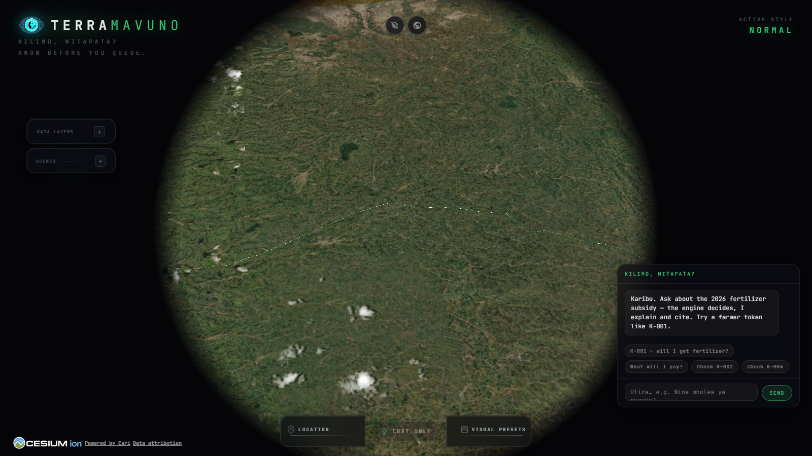
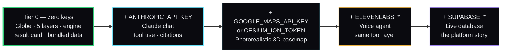
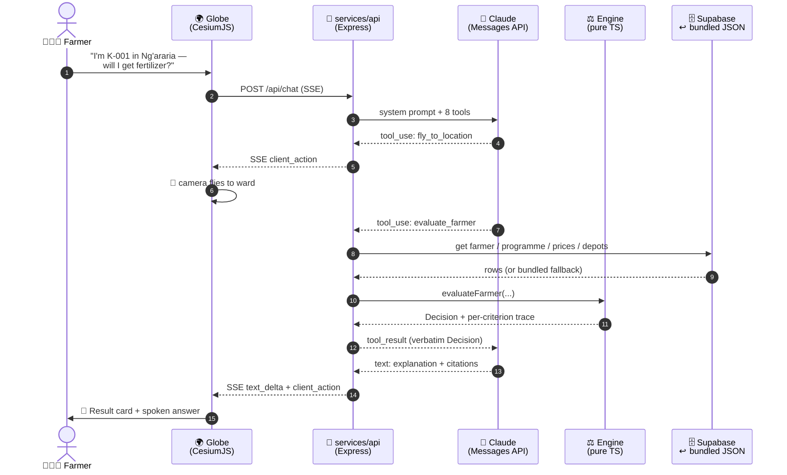
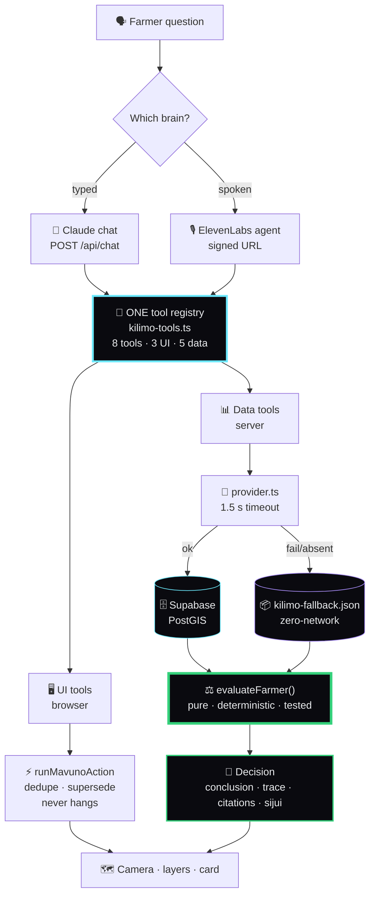
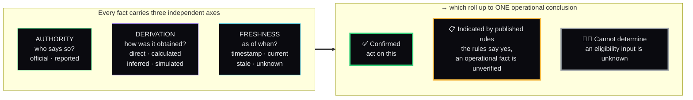
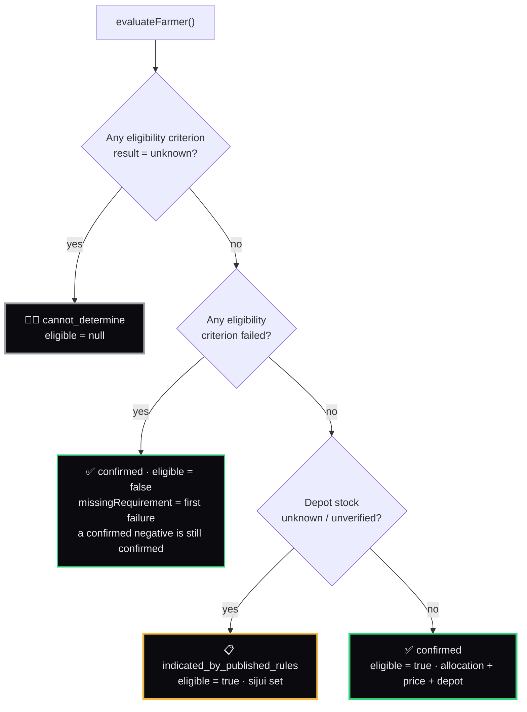
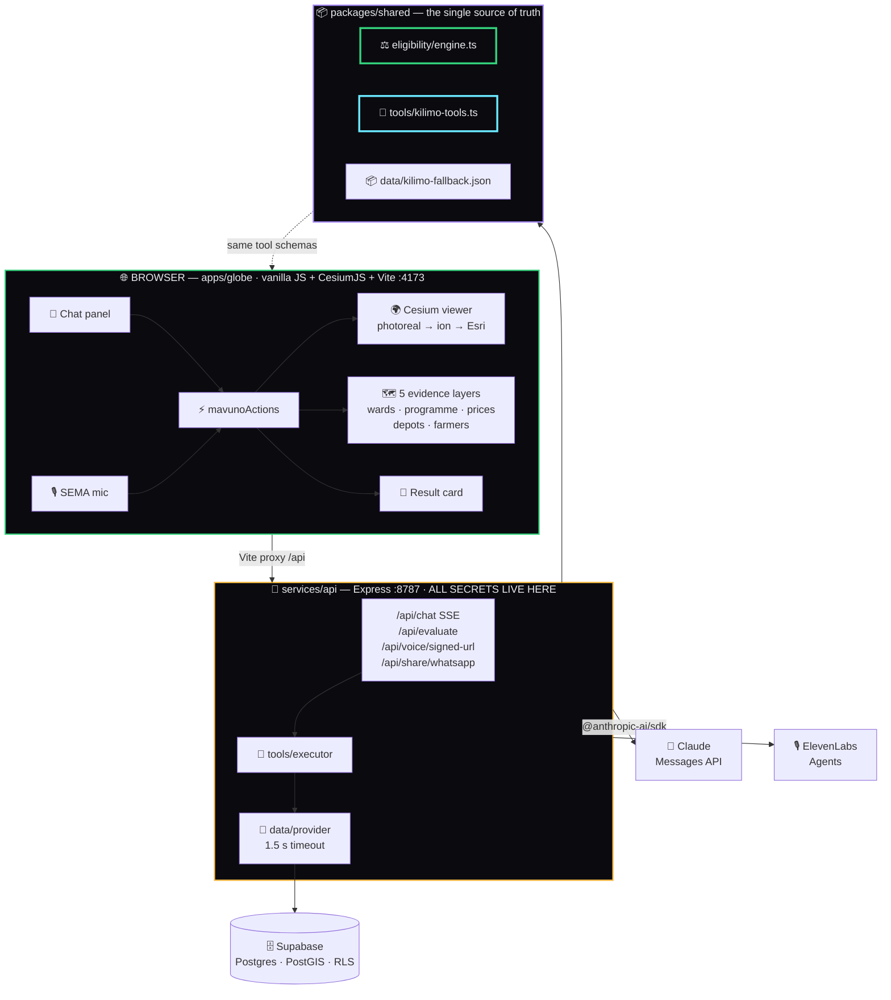

<div align="center">

# 🌍 *Nielekeze* by TerraMavuno

### **Know before you queue.**

**A registered Kenyan smallholder asks — by text or voice, in English or Kiswahili —
*"Will I get the subsidized fertilizer, what will I pay, and where do I go?"*
and gets a cited, deterministic answer on a cinematic 3D globe — before spending a day travelling to a depot.**

[](#-verification)
[](#-verification)
[](#-the-key-tiers)
[](LICENSE)
[](docs/DATA_SOURCES.md)



<sub>Captured **keyless** (no API keys) on Esri World Imagery via `node scripts/verify-globe-boot.mjs`.<br/>With a Google Map Tiles or Cesium ion key, the basemap upgrades to photorealistic 3D.</sub>

</div>

---

## 📋 Table of contents

| | | |
|---|---|---|
| [The problem](#-the-problem) | [What makes it different](#-what-makes-it-different) | [Quickstart](#-quickstart) |
| [The key tiers](#-the-key-tiers) | [How it works](#-how-it-works) | [The truth model](#-the-truth-model) |
| [The eligibility engine](#-the-eligibility-engine) | [The sijui case](#-the-sijui-case) | [Architecture](#-architecture) |
| [Repo layout](#-repo-layout) | [API reference](#-api-reference) | [The tool layer](#-the-tool-layer) |
| [Database](#-database) | [Verification](#-verification) | [Demo script](#-demo-script) |
| [Licensing](#-licensing--attribution) | [Docs](#-full-documentation) | [Roadmap](#-roadmap) |

---

## 🎯 The problem

> A smallholder in Kandara hears there is a fertilizer subsidy. She does not know whether she qualifies, what the gazetted price is, which depot serves her ward, or whether that depot has stock today.
>
> So she travels. She queues. She finds out at the counter — after losing a working day and the fare.

Kenya publishes the rules. It publishes the prices. It publishes the depots. **The information exists — it is just not answerable from where the farmer is standing.**

`Nielekeze` is Swahili for *"direct me"* — *show me the way.* That is the entire product question: will I get it, what will I pay, and where do I go?

<table>
<tr><th align="left" width="50%">❌ What this is not</th><th align="left" width="50%">✅ What this is</th></tr>
<tr valign="top"><td>

- A chatbot pasted on top of a map
- An AI that guesses eligibility
- A planner's budget-allocation tool
- A greenhouse / BOQ / contract generator
- A dashboard of live satellite feeds

</td><td>

- A **tested rules engine** that decides
- **Claude explaining** that decision, with citations
- One **P0 user**: the registered smallholder
- Every fact carrying an **evidence chip**
- An answer that says ***sijui*** when it doesn't know

</td></tr>
</table>

---

## ⭐ What makes it different

<table>
<tr valign="top">
<td width="33%">

### ⚖️ The engine decides
Eligibility is computed by a **pure, deterministic, unit-tested TypeScript function** — never by the model. Claude cannot invent a verdict; it can only explain the one the engine returned.

`packages/shared/src/eligibility/engine.ts`

</td>
<td width="33%">

### 🏷️ Every fact is tagged
Three independent axes — **Authority × Derivation × Freshness** — instead of one muddled "confidence" score. *Official* is about authority; *live* is about time. They are not the same thing.

`[Official · Direct · 2026-08-14]`

</td>
<td width="33%">

### 🤷🏾 It admits ignorance
The demo deliberately includes a case the system **cannot** answer, and it says so in plain words rather than guessing. Honest uncertainty is the feature, not a gap.

***"…lakini sijui."***

</td>
</tr>
<tr valign="top">
<td>

### 🗺️ The map does real work
The globe isn't decoration. Claude **drives** it — flying to the ward under discussion, toggling the evidence layer that supports the claim, and pinning the depot you're being sent to.

Forked from God's Eye View (MIT).

</td>
<td>

### 🎙️ One brain-stem, two brains
Text chat and voice share **one tool registry**, one action runner and one result card. A schema can't drift between them because there is only one schema.

`packages/shared/src/tools/kilimo-tools.ts`

</td>
<td>

### 🔌 It degrades, never dies
No keys → the globe, layers and full eligibility journey still run on bundled data. Supabase down → bundled snapshot. Claude down → the card still renders. Voice flaky → chat.

**Nothing 500s. Ever.**

</td>
</tr>
</table>

---

## 🚀 Quickstart

```powershell
git clone <this-repo>
cd claude-nairobi-impact-jice
npm install
```

```powershell
# Terminal 1 — the API (secrets live here)
npm run dev:api          # → http://localhost:8787

# Terminal 2 — the globe
npm run dev              # → http://localhost:4173
```

**That's it. No `.env` required.** The demo boots keyless on Esri World Imagery with the full bundled dataset.

<details>
<summary><b>Optional — add keys to unlock more</b></summary>

```powershell
Copy-Item .env.example .env
notepad .env
```

See [**The key tiers**](#-the-key-tiers) below, or [`docs/API_KEYS.md`](docs/API_KEYS.md) for a click-by-click guide to obtaining each one.
</details>

<details>
<summary><b>Health checks</b></summary>

```powershell
Invoke-RestMethod http://localhost:8787/health
Invoke-RestMethod http://localhost:8787/api/evaluate -Method Post `
  -ContentType 'application/json' -Body '{"token":"K-004"}'
```
</details>

---

## 🔑 The key tiers

**The demo is designed so that every key is optional.** Each one upgrades a specific capability; none is load-bearing.



| Variable | Exposure | Unlocks | Without it |
|---|:---:|---|---|
| *(none)* | — | Globe, 5 evidence layers, eligibility engine, result card | **Fully working demo** |
| `ANTHROPIC_API_KEY` | 🔒 server | Claude text chat with tool use | Chat panel shows *"chat unavailable — the map still works"*; suggested prompts fall back to calling the engine directly |
| `GOOGLE_MAPS_API_KEY` | 🌐 **browser** | Google Photorealistic 3D Tiles | Falls back to Cesium ion → Esri World Imagery |
| `VITE_CESIUM_ION_TOKEN` | 🌐 **browser** | ion imagery + world terrain | Falls back to Esri |
| `ELEVENLABS_API_KEY`<br/>`ELEVENLABS_AGENT_ID` | 🔒 server | Voice agent (`SEMA` mic button) | Mic disabled, tooltip *"voice unavailable — using chat"*; endpoint returns `503 {available:false}` |
| `SUPABASE_SECRET_KEY`<br/>`SUPABASE_URL` | 🔒 server | Live Postgres + PostGIS reads | Provider times out at 1.5 s and serves the bundled snapshot; response says `dataMode: "bundled"` |
| `EVOLUTION_API_*` *or* `WHATSAPP_CLOUD_*` | 🔒 server | WhatsApp share of the result card | Share button hidden; `wa.me` deep-link and copy-to-clipboard still work |

> [!WARNING]
> `GOOGLE_MAPS_API_KEY` and `VITE_CESIUM_ION_TOKEN` **reach the browser by design** — that is how the tile APIs work. Restrict them by HTTP referrer in the provider console. Every other key stays server-side in `services/api` and never touches the bundle.

> [!CAUTION]
> Your Supabase **personal access token** (`sbp_…`) is for local CLI/MCP auth **only**. Never put it in `.env`, never commit it. If it has been pasted into a chat, rotate it in the Supabase dashboard.

---

## ⚙️ How it works

### The full request path



> [!IMPORTANT]
> Note steps 9–12. Claude **requests** the evaluation but never performs it. The verdict originates in `evaluateFarmer()` and is passed back to the model as a `tool_result` it must restate — not reinterpret.

### Where the answer comes from



---

## 🏷️ The truth model

Most systems collapse provenance into one word — *live*, *verified*, *official* — and lose meaning. **"Live" is a statement about time. "Official" is a statement about authority.** They vary independently, so we track them independently.



In the UI these render as chips, colour-coded by the same tokens throughout:

| Chip | Meaning | Token |
|---|---|---|
| 🟢 `[Official · Direct · 2026-08-14]` | Gazetted, read straight from the source, dated | `--official #34d17b` |
| 🟠 `[Reported · Direct · 2026-09-01]` | Second-hand but timestamped | `--reported #f5b942` |
| 🟣 `[Reported · Simulated · —]` | **Synthetic demo data**, always labelled | `--simulated #a78bfa` |
| 🔴 `[… · Freshness unknown]` | We do not know how old this is | `--stale #f87171` |

> [!NOTE]
> We deliberately **do not** display a numeric "AI confidence" percentage. An uncalibrated number is false precision dressed as rigour.

---

## ⚖️ The eligibility engine

A pure function. No I/O, no `Date.now()` inside, no randomness — `now` is an argument, so identical inputs always produce a deep-equal `Decision`. That property is asserted by a test.

```ts
evaluateFarmer({ farmer, programme, prices, depots, now }): Decision
```

### Decision precedence



### The five criteria

| Test | Checks | Unknown ⇒ |
|---|---|---|
| `in_register` | Farmer appears in the Kenya Farmer Register | `cannot_determine` |
| `id_linked` | National ID linked to the register entry | — |
| `acreage_max` | Farm within the 5-acre cap | `cannot_determine` |
| `ward_participating` | Ward is in the programme's participating list | — |
| `stock_available` | **Operational**, checked at the assigned depot | ***sijui*** |

Allocation is `min(bagsPerAcre × acreage, maxBags)` = `min(2 × acres, 10)`, tagged **Calculated** — never presented as gazetted fact.

### The four synthetic farmers

Every state in the model has a worked example. Tokens only — **no names, no national IDs, no phone numbers, ever.**

| Token | Ward | Situation | Conclusion | Outcome |
|:---:|---|---|---|---|
| 🟢 **K-001** | Ng'araria | Registered, ID linked, 2 acres | `confirmed` | **4 bags @ KES 2,500** (mkt 6,500) → NCPB Sagana |
| 🟠 **K-002** | Muruka | Registered, **ID not linked** | `confirmed` | Not yet eligible → *visit the ward agricultural office* |
| 🔴 **K-003** | Gaichanjiru | Registered, **7.5 acres** (over cap) | `confirmed` | Not eligible → *contact the county office* |
| 🤷🏾 **K-004** | Kandara | Registered — routed to a depot with **unverified stock** | `indicated_by_published_rules` | **The sijui case** ↓ |
| ⚪ **K-005** | — | Register status **unknown** | `cannot_determine` | Cannot answer without the register |

---

## 🤷🏾 The sijui case

<div align="center">

> ### *"Rules indicate you qualify, but I cannot verify today's stock at this depot."*

</div>

This is the most important four seconds of the demo.

**K-004** satisfies every published rule. The engine confirms that. But her assigned depot — *Kabati Agrovet* — has `stockStatus: "unknown"` and `checkedAt: null`. Nobody has verified stock today.

A system optimising for a confident answer would round up to *"yes, go."* She travels. She queues. The depot is empty. **The confident answer cost her a day.**

So the engine returns `indicated_by_published_rules` instead of `confirmed`, attaches the sijui string, and the card renders an amber pill with the unverified timestamp shown plainly. Claude is instructed to say the sentence and **not** to guess around it.

Verified by test — the string is asserted character-for-character, and `npm run validate:data` fails the build if it ever drifts:

```
K-001  confirmed                      eligible=true
K-002  confirmed                      eligible=false
K-003  confirmed                      eligible=false
K-004  indicated_by_published_rules   eligible=true      ← sijui
K-005  cannot_determine               eligible=null

Bundled dataset OK.
```

---

## 🏗️ Architecture



**One deliberate departure from the God's Eye View original.** GEV puts ~20 upstream API proxies inside a 7,735-line `vite.config.js`. We cut that config to **86 lines** and moved every secret-holding route into `services/api`. The Vite dev server proxies `/api` and holds nothing sensitive.

---

## 📂 Repo layout

```
claude-nairobi-impact-jice/
│
├── apps/globe/                     🌍 THE DEMO — GEV fork (vanilla JS + Cesium + Vite)
│   ├── vite.config.js                 86 lines (from GEV's 7,735) — proxy only, no secrets
│   ├── style.css                      glass UI · harvest-green accent · evidence chips
│   ├── NOTICE.md                      God's Eye View MIT attribution
│   └── src/
│       ├── main.js                    Cesium bootstrap · window.__KILIMO__ handle
│       ├── data/kilimo/               5 evidence layers + evidenceBadges renderer
│       ├── data/local_data/kenya/     real geoBoundaries geometry + depots
│       ├── actions/mavunoActions.js   the action runner (dedupe · supersede · never hangs)
│       ├── chat/                      SSE client + glass chat panel
│       ├── voice/voiceClient.js       ElevenLabs, same tool layer
│       ├── farmerCard/resultCard.js   the Decision card
│       └── overlays/ scenes/ styles/  retained GEV canvas-label & cinematic systems
│
├── services/api/                   🔌 EXPRESS — every secret lives here
│   └── src/
│       ├── channels.ts africastalking.ts   USSD + SMS farmer channel
│       ├── field-reports.ts                community evidence -> provenance
│       ├── claude/route.ts            SSE agentic tool-use loop
│       ├── claude/systemPrompt.ts     honesty rules ported from GEV
│       ├── tools/executor.ts          the 5 data tools → engine
│       ├── data/provider.ts           Supabase → bundled fallback
│       └── routes/                    kilimo · voice · share
│
├── packages/shared/                📦 SINGLE SOURCE OF TRUTH
│   └── src/
│       ├── eligibility/               types · engine · fixtures · tests
│       ├── tools/kilimo-tools.ts      8 tools + Anthropic & ElevenLabs adapters
│       └── data/                      bundled offline snapshot
│
├── supabase/                       🗄️ 23 tables · PostGIS · full RLS
│   ├── migrations/                    initial schema + kilimo_subsidy
│   └── seed.sql                       47 counties + the Kilimo section
│
├── scripts/                        🛠️ geometry · validation · boot verification
├── docs/                           📚 PRD · architecture · data sources · runbook · keys
└── references/                     📖 study material — gitignored, never shipped
```

---

## 🔌 API reference

All routes on `http://localhost:8787`. Every response carries `dataMode: "supabase" | "bundled"`.

| Method | Route | Purpose |
|:---:|---|---|
| `GET` | `/health` | Status + `dataMode` + integration booleans (**never key values**) |
| `POST` | **`/api/chat`** | **Claude SSE agentic loop** — the main brain |
| `POST` | **`/api/evaluate`** | **Run the engine** for a farmer token → `Decision` |
| `GET` | `/api/programme` | Programme rules + criteria + evidence tags |
| `GET` | `/api/prices` | Gazetted price / allocation schedule |
| `GET` | `/api/depots?ward=` | Depots, sorted nearest-first |
| `GET` | `/api/farmers` · `/api/farmers/:token` | Synthetic tokens (404 rather than invent one) |
| `GET` | `/api/voice/signed-url` | ElevenLabs broker → `{signedUrl}` or `503 {available:false}` |
| `GET` | `/api/voice/health` · `/api/share/health` | Capability probes for feature-flagging the UI |
| `POST` | `/api/share/whatsapp` | Send the card via Evolution API / WhatsApp Cloud |
| `GET` | `/api/tools` · `POST` `/api/simulations` | Legacy climate-action endpoints (retained) |

<details>
<summary><b>SSE event contract for <code>/api/chat</code></b></summary>

```jsonc
{ "type": "text_delta",    "text": "…" }              // stream into the panel
{ "type": "tool_start",    "name": "evaluate_farmer" } // show the indicator
{ "type": "client_action", "id": "…", "name": "fly_to_location", "args": {…} }
{ "type": "error",         "code": "chat_unavailable", "message": "…" }
{ "type": "done" }
```

**Invariant, inherited from God's Eye View:** *every* tool call is answered — UI tools are acknowledged server-side with `{ok:true, note:'dispatched to map'}` — because an unanswered `tool_use` block deadlocks the model.
</details>

---

## 🧰 The tool layer

Eight tools, defined **once**, adapted to both providers so schemas cannot drift.

```ts
KILIMO_TOOLS                 // canonical array
toAnthropicTools()           // → { name, description, input_schema }
toElevenLabsClientTools()    // → ElevenLabs client-tool shape
isUiTool(name) / isDataTool(name)
```

| Tool | Kind | Runs in | Notes |
|---|:---:|:---:|---|
| `fly_to_location` | 🖥️ UI | browser | Model must fly **before** discussing a place |
| `set_layer_visibility` | 🖥️ UI | browser | `wards · programme · prices · depots · farmers` |
| `show_result_card` | 🖥️ UI | browser | Passes the `Decision` through verbatim |
| `get_programme` | 📊 data | server | Rules + criteria + evidence |
| `get_price_schedule` | 📊 data | server | Gazetted prices |
| `get_depots` | 📊 data | server | Nearest-first |
| `get_farmer` | 📊 data | server | Synthetic token lookup |
| **`evaluate_farmer`** | 📊 data | server | **The only route to a verdict** |

---

## 🗄️ Database

**23 tables**, PostGIS geometry, full row-level security. The Kilimo work extends the existing schema rather than replacing it.

| Migration | Adds |
|---|---|
| `20260902104652_initial_terramavuno_schema.sql` | 21 tables — `administrative_areas` (PostGIS), `data_sources`, `programmes`, `infrastructure_assets`, `evidence_records`, `provenance_events`, RLS policy loop |
| `20260903000000_kilimo_subsidy.sql` | **`farmer_tokens`** (no-PII, state-constrained) · **`subsidy_prices`** · indexes · RLS |

The seed adds Murang'a → Kandara → 6 wards with centroids, the programme with its criteria in `metadata`, the gazetted price row, 4 depots as PostGIS points, the farmer tokens, plus `evidence_records` and `provenance_events` for every headline claim.

```powershell
npx supabase login                                    # one-time, interactive
npx supabase link --project-ref gxecynujvqmubkezqpgt
npx supabase db push                                  # apply migrations
```

See [`supabase/KILIMO_SEED_NOTES.md`](supabase/KILIMO_SEED_NOTES.md) for rollback and local-reset instructions.

> [!NOTE]
> **Supabase is optional for the demo.** If it is unreachable or unconfigured, `provider.ts` times out at 1.5 s and serves the bundled snapshot, flagging `dataMode: "bundled"`.

---

## ✅ Verification

```powershell
npm test              # 88 tests — 33 shared + 55 API
npm run typecheck     # clean
npm run validate:data # engine runs over every synthetic farmer
npm run build         # production build of all workspaces
```

| Suite | Tests | Covers |
|---|:---:|---|
| `packages/shared` | **33** | Engine per farmer state · allocation cap · **exact sijui string** · determinism (deep-equal on repeat) · citation completeness · tool-schema partition · data consistency |
| `services/api` | **55** | Provider fallback (incl. a real 1.5 s timeout) · executor · SSE loop · UI-tool acknowledgement · WhatsApp formatter · every route |

<details>
<summary><b>Headless boot check</b></summary>

```powershell
npm run dev --workspace @terramavuno/globe   # terminal 1
node scripts/verify-globe-boot.mjs shot.png  # terminal 2
```

Asserts the `window.__KILIMO__` handle, all five registered layers, the chat mount, and reports console/page errors.

> Cesium runs in `requestRenderMode`. A screenshot taken without forcing a render shows a **blank white globe even when tiles loaded perfectly** — the verify script forces fresh frames. Don't lose an hour to this.
</details>

---

## 🎬 Demo script

<table>
<tr><th width="8%">#</th><th width="42%">Beat</th><th>What the judge sees</th></tr>
<tr><td align="center">1</td><td>Cinematic orbit into Kenya → Murang'a</td><td>Kandara ward boundaries draw over satellite imagery</td></tr>
<tr><td align="center">2</td><td><i>"Nina mbolea ya ruzuku? I'm registered in Kandara — will I get subsidized fertilizer, what will I pay, and where do I go?"</i></td><td>Camera flies to Ng'araria; layers toggle to match</td></tr>
<tr><td align="center">3</td><td>Claude calls <code>evaluate_farmer</code></td><td>🟢 <b>Confirmed</b> · 4 bags @ KES 2,500 vs 6,500 market · NCPB Sagana · every row chipped and cited</td></tr>
<tr><td align="center">4</td><td>Check <b>K-002</b></td><td>Not yet eligible — national ID not linked → <i>visit the ward agricultural office</i></td></tr>
<tr><td align="center">5</td><td>Check <b>K-003</b></td><td>Over the 5-acre cap — a clean, confirmed negative</td></tr>
<tr><td align="center">6</td><td>🤷🏾 <b>Check K-004 — the sijui moment</b></td><td>🟠 <b>Indicated by published rules</b> + <i>"…but I cannot verify today's stock at this depot."</i> <b>Pause here.</b></td></tr>
<tr><td align="center">7</td><td>Share via WhatsApp <i>(stretch)</i></td><td>Card text arrives on a phone</td></tr>
</table>

**Fallback order if something breaks live:** voice fails → chat · Supabase fails → bundled · Claude fails → suggested prompts call the engine directly and still render the card · photoreal fails → aerial imagery.

Full narration in [`docs/DEMO_SCRIPT.md`](docs/DEMO_SCRIPT.md).

---

## 📜 Licensing & attribution

**Source code: [MIT](LICENSE).** Data is a different matter — see [`docs/DATA_SOURCES.md`](docs/DATA_SOURCES.md) for the full table.

| Source | Licence | Obligation |
|---|---|---|
| **God's Eye View** (globe shell) | MIT | Attributed in [`apps/globe/NOTICE.md`](apps/globe/NOTICE.md) |
| **geoBoundaries** KEN ADM1/ADM3 | CC BY 4.0 | Attribution required |
| **kenya-locations** | MIT | 47 counties → 1,448 wards |
| **Natural Earth** | Public domain | Courtesy credit |
| MoALD circular · Gazette notice · NCPB depot list | Official documents | Cited inline with effective dates |
| Synthetic depots & farmer tokens | — | **Always labelled `SIMULATED` in-app** |
| Google Map Tiles · Cesium ion | Proprietary, BYOK | In-app credit must stay visible |

> [!IMPORTANT]
> God's Eye View bundles **TeleGeography submarine-cable data under CC BY-NC-SA** (non-commercial). It was **deleted** from this fork. If you re-sync from upstream, delete it again.
>
> `references/agrion` is **unlicensed** — architecture study only, never copied, and `references/` is gitignored so it can never be committed.

---

## 📚 Full documentation

| Doc | What's in it |
|---|---|
| [**PRD**](docs/PRD.md) | One P0 user, the 8-item scope, acceptance criteria, out-of-scope & stretch |
| [**Architecture**](docs/ARCHITECTURE.md) | Layer diagram, the `Decision` contract, why the Vite config is thin |
| [**Data sources**](docs/DATA_SOURCES.md) | Every source, licence and attribution string |
| [**Risk & provenance**](docs/RISK_AND_PROVENANCE.md) | Engine/model separation, PII minimisation, demo-day risks |
| [**Demo script**](docs/DEMO_SCRIPT.md) | Beat-by-beat narration + cut-list |
| [**Runbook**](docs/RUNBOOK.md) | PowerShell commands, health checks, troubleshooting |
| [**API keys**](docs/API_KEYS.md) | Click-by-click for every key, exposure and restriction |

---

## 📱 Second surface — the farmer channel

The globe answers a farmer who can reach a browser or a voice agent. **Most cannot.** A parallel
Africa's Talking **USSD + SMS** channel shares this same API, so the reach of the product is not
limited to officials with laptops.

| | |
|---|---|
| **USSD menu** | Outlook, field report, SMS advisory — stateful session, no account needed |
| **Inbound SMS** | `REPORT <county> …`, a bare county name, and `STOP` / `START` |
| **Identity** | Provider session ids are **salted and hashed**; a raw phone number is rejected, not stored |
| **Persistence** | An inbound report writes `conversations` + `evidence_records` + `provenance_events`, deduplicated against provider retries |
| **Classification** | Everything that comes back is `community` / `unverified` — ground truth, never presented as official |
| **Degrades** | No Supabase → in-memory (reports lost on restart); `GET /health` says which |

```powershell
npm run channels:urls      # print the exact callback URLs for the AT dashboard
```

Endpoints live under `/channels/*` and `POST /api/field-reports`. See
[omnichannel](modules/omnichannel/README.md), the farmer-channel sections of the
[runbook](docs/RUNBOOK.md) and [API keys](docs/API_KEYS.md).

> [!WARNING]
> Africa's Talking **does not sign its webhooks**. `CHANNEL_WEBHOOK_TOKEN` plus an IP allowlist is
> the entire authentication story — treat the token like a password. Webhooks return `503` until it
> is set. `FIELD_REPORT_SALT` must be set anywhere real: an unsalted hash of a Kenyan MSISDN is
> brute-forceable in seconds.

---

## 🗺️ Roadmap

**Shipped (P0)** — globe · 5 evidence layers · deterministic engine · Claude chat with tool use · ElevenLabs voice · result card · the sijui case · Supabase schema · bundled offline fallback.

**Stretch** — WhatsApp share · county comparison (Makueni, Nakuru) · USSD simulator.

**Later platform modules** — county implementation library · climate & logistics planning · implementation simulation studio · farmer office. Deliberately **out** of the hackathon build: greenhouse/BOQ simulation, contract generation, aircraft/ship/news feeds.

---

<div align="center">

**TerraMavuno** is Kenya's spatial evidence layer for agricultural public services.
**Nielekeze by TerraMavuno** is its first product — telling a registered farmer what the published rules indicate they can receive,
what they still lack, what the documented price is, where to go —
**and when the evidence cannot confirm an answer.**

### *Know before you queue.*

</div>
